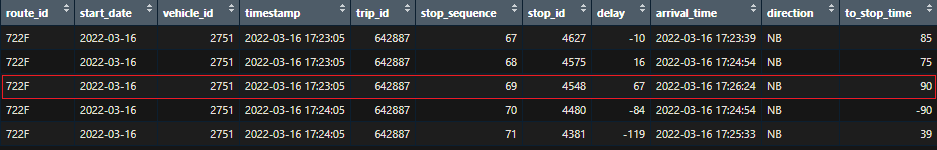

```{r setup, include=FALSE}
knitr::opts_chunk$set(echo = FALSE, message = FALSE, warning = FALSE, cache = TRUE, fig.align = "center")
```

```{r libraries}
library(tidyverse)
library(here)
library(lubridate)
library(leaflet)
library(hms)
library(janitor)
library(broom)
library(kableExtra)
library(scales)
```

```{r data}
# Holidays dates
holidays_raw <- read_csv(here("data/addinsight/addinsight_prod.btspecialdays.csv.csv"))

# Links information
links_raw <- read_csv(here("data/AddInsight/addinsight_prod.btlinks.csv.csv"))

# List of links on South Rd and their geometries
southrd_links_raw <- read_csv(here("data/South-Rd/BT Links - South Rd.csv"))

# List of links on Marion Rd and their geometries
marionrd_links_raw <- read_csv(here("data/Marion-Rd/Marion Rd Links.csv"))

# Stops information
full_stops_raw <- read_csv(here("data/GTFS/stops.csv"))

# Routes, trips, and stops on South Rd
southrd_routes_stops_raw <- read_csv(here("data/South-Rd/South Rd Routes and Trips gtfs 1157.csv"))

# Routes, trips, and stops on Marion Rd
marionrd_routes_stops_raw <- read_csv(here("data/Marion-Rd/Marion Rd Routes Stops.csv"))

# GTFS-R Trip Updates for South Rd
southrd_updates_raw <- read_csv(here("data/South-Rd/trip_updates_SouthRd_Mar.csv"))

# GTFS-R Trip Updates for Marion Rd
marionrd_updates_raw <- read_csv(here("data/Marion-Rd/trip_updates_MarionRd_Mar.csv"))

# South Rd link statistics
southrd_link_stats_raw <- read_csv(here("data/South-Rd/link_stats_Mar.csv"))

# Marion Rd link statistics
marionrd_link_stats_raw <- read_csv(here("data/Marion-Rd/link_stats_Mar.csv"))
```

# Abstract

# Background

Adelaide's population increased from 1.1 million to 1.3 million residents between 2006 and 2016, with 66 million more kilometers traveled on the road network during that time. Infrastructure Australia paints a dire picture of the level of road congestion in Adelaide and its continued worsening in the coming years in line with both an increasing population and an increasing reliance on public transport in comparison to cars. The report estimated the annualized cost of road congestion for Greater Adelaide to be approximately \$1.4 billion in 2016 and is projected to rise to \$2.6 billion in 2031 (Infrastructure Australia, 2019).

With this backdrop in mind, the client (the South Australia Department for Infrastructure and Transport (DIT)) has in its possession an untapped wealth of data relating to traffic information collected through Bluetooth probes, which take count of passing motor vehicles in a particular time and location, therefore producing a metric for road congestion.

This data will be examined in conjunction with publicly available, historical real time bus trip updates collected by General Transit Feed Specification Realtime (GTFSr), which provides the arrival time for each stop on a bus's trip. The analysis aims to identify the relationship and robustness of bus travel times to road congestion on road segments of interest.

# Objectives

The aim of the proposed analysis is to investigate the extent of the relationship between bus travel times and road congestion - as measured by motor vehicle travel times - on identified road segments, where a strong relationship indicates a road segment where the bus travel times are less robust to congestion.

Initially, the bus performance metric to be used and applied was the average delay experienced by a bus trip on the segment of interest, as measured by a stop's predicted arrival time versus the scheduled arrival time. However, this was later revised to measuring the bus travel time between the first and last stops of a segment, removing the possibility that we are measuring how accurately the schedule predicts and/or buffers for congestion. The road congestion metric used is the average travel time of the vehicles across the segment.

A proposal outlining the analysis, the objectives, and the methodology was created and sent to the client, this was followed by a discussion with the client to provide more information regarding the analysis and clarify any points raised by the client. Ultimately, an agreement was reached for the analysis to fulfill the following objectives:

1.  Detailed travel time or congestion analysis comparing public transport response to road traffic on selected sections of road over a given period of time

2.  Repeatable methodology, code, functions, and visuals that produce detailed analysis on other segments of interest

In fulfilling the first objective, the segments of road analysed are South Road and Marion Road in Adelaide. This report uses the former to illustrate the methodology, while the latter is used for comparison. The period of time chosen is March 2022.

Regarding the second objective, the methodology and the code created aim to ensure the requirement of as little manual input and edits as possible when applied to different road segments.

The analysis undertaken in this report will form the basis of future analysis into:

-   additional road segments of interest to generate a ranking of bus network robustness which can help inform the allocation of resources

-   analysing the factors that can effect bus travel times such as the use of bus lanes, number of bus stops, traffic lights, etc.

-   creating a model predicting bus travel times using identified features.

# Data Sources, Description, and Wrangling

Three main data sources are used: DIT Addinsight, GTFS, and GTFSR. These data sources and their associated sub-sources will be outlined below. All the data is stored in the cloud using Amazon Web Services (AWS) and is accessed through Athena which uses regular SQL syntax.

The data cleaning and wrangling will be discussed as it was the part of the analysis that required the highest workload.

As mentioned above, the methodology will be illustrated on South Road, which is one of Adelaide's most important and major roads, and regularly suffers from congestion (Infrastructure Australia, 2019).

```{r, fig.cap="South Rd on map. Source: Google Maps"}

```

## General Transit Feed Specification (GTFS)

This is a common format developed by Google and used by public transport agencies around the world and contains static or scheduled information about public transport services such as routes, stops, schedule and geographic transit information. For the purposes of this analysis, only the bus routes and bus stops datasets will be used.

### Routes

These are the bus routes that go through South Road. These were identified by overlaying all the network routes on a map in Tableau and the routes on South Road were highlighted and exported to a list. The dataset contains simply the unique collection of route_id on the segment.

```{r}
segment_route_stops <- clean_names(southrd_routes_stops_raw)
  
segment_routes <- segment_route_stops %>% 
  pull(route_id) %>% 
  unique()
```

### Stops

The list of bus stops on the segment were identified in the same fashion as when identifying the routes. This produces a list of the stop_id's on the segment.

A dataset containing all the stops in the bus network and information relating to each stop is used and filtered to only the stops present on the segment (for the purposes of this report, the file containing all the stops on the network was pre-filtered to the stops on the segment only to accommodate Github file size limits. However, the code and methodology contained here apply as if the complete dataset were used and filtered through the code).

```{r}
segment_stops <- segment_route_stops %>% 
  pull(stop_id_gtfs_history_prod_stops_csv) %>% 
  unique()

# Join stops information to stops on the segment
stops_segment <- full_stops_raw %>%
  filter(stop_id %in% segment_stops) %>%
  select(stop_id, stop_name, stop_desc, stop_lat, stop_lon) %>%
  distinct(stop_id, .keep_all = TRUE) %>%
  # If stop is on East side, that means trip SB, and vice versa
  mutate(direction = if_else(str_detect(stop_name, "East"), "SB", "NB"))

rm(southrd_routes_stops_raw)
```

```{r, stops-desc}
stops_segment %>% 
  names() %>% 
  as_tibble_col("Variable") %>% 
  mutate(Description = c("Unique stop identifier",
                         "Name of the location. Uses a name that people will understand",
                         "Address of the stop",
                         "Latitude of the stop",
                         "Longitude of the stop",
                         "Road direction of the stop")) %>% 
  kable(caption = "Stops data description") %>% 
  kable_styling(full_width = FALSE)
```

The `direction` variable is manually created. In this case, if the stop is on the east side of South Road, then it is southbound (SB) away from the city; if the stop is on the west side of South Road, this it is northbound (NB) towards the city.

The bus stops will be plotted on a map to confirm they are all, in fact, on South Road.

```{r, fig.cap="Bus stops on South Road"}
# Plot on map to check the stops are all on South Rd
stops_segment %>%
    leaflet() %>% 
    addTiles() %>% 
    addCircles(lat = ~stop_lat, lng = ~stop_lon, label = ~ stop_id, opacity = 1)
```

## General Transit Feed Specification Realtime (GTFSR)

Unlike GTFS which provides static information, GTFSR provides real time information consisting of two types. The first type is a trip's real time updates regarding a bus stop's expected arrival times and delays. The second type is a real time update of a bus's geographic position and speed at a specific point in time. This analysis uses the former only.

### Trip Updates

```{r}
# Keep only updates for stops on segment and remove weekends and public holidays
updates <- southrd_updates_raw %>%
  rename(
    trip_id = id,
    vehicle_id = label) %>%
  mutate(
    start_date = ymd(start_date),
    timestamp = as_datetime(timestamp, tz = "Australia/Adelaide"),
    arrival_time = as_datetime(arrival_time, tz = "Australia/Adelaide")) %>%
  select(-direction_id, -wheelchair_accessible) 
```

Once the bus routes that go through the segment were identified as outlined above, the real time updates for all the trips in March 2022 according to the routes were retrieved from the AWS database using Athena. This dataset is used to derive the bus travel time through the segment, which is the first element in the relationship being assessed in this analysis, with the other being the vehicles travel time as a measure of congestion. The SQL query to retrieve the updates can be found in appendix \@ref(trip-updates-sql-query).

First, the unedited data will be described.

```{r}
updates %>% 
  names() %>% 
  as_tibble_col("Variable") %>% 
  mutate(Description = c("Unique route identifier",
                         "Start date of the trip",
                         "Unique vehicle identifier",
                         "Timestamp of the real time update",
                         "Unique trip identifier",
                         "Order of stops for a particular trip",
                         "Unique stop identifier",
                         "The current schedule deviation for the trip. 
                         The delay (in seconds) can be positive (meaning that the vehicle is late) 
                         or negative (meaning that the vehicle is ahead of schedule)", 
                         "Predicted arrival time for a stop on a particular trip")) %>% 
  kable(caption = "Unedited updates data description") %>% 
  kable_styling(full_width = FALSE)
```

It is important to note the following:

-   One `route_id` can have many `trip_id`s

-   One `trip_id` occurs a maximum of one time a day, the `trip_id` can occur on multiple days

As a bus trip is occurring, at a certain timestamp a real time prediction of the arrival times of the remaining stops on the trip are updated.

Cleaning and wrangling this dataset proved to be the most challenging and time consuming section of this analysis, with many methodologies, cleaning iterations, and code trialed to arrive at the optimal treatment. This is due to the complex relationships between the observations in the dataset, and the variety of errors and inconsistencies encountered.

The following preliminary adjustments were done:

1. As each stop on a given trip can have multiple arrival time predictions with each update timestamp prior to reaching that stop, the SQL query insures that each stop only has the predicted arrival time corresponding to the latest timestamp, given that the later the prediction, the more accurate it is.

2. As a trip can begin and end outside the bounds of the segment, the updates were constrained only to those stops within the segment, in either direction.

3. Weekends and holidays were removed as we are interested in the relationships during working days.

```{r}
holidays <- unique(holidays_raw$date)

rm(holidays_raw)
```

```{r}
updates <- updates %>%
  inner_join(select(stops_segment, stop_id, direction), by = "stop_id") %>%
  filter(
    !start_date %in% holidays,
    !wday(start_date, label = TRUE) %in% c("Sat", "Sun"))
```

A new variable `to_stop_time` was created. This variable measures the time taken to reach each stop from the prior stop in seconds, within each trip. The variable was created to facilitate a potential deeper understanding of the data, to highlight any errors, and for potential utilities in the future such as drilling down to examine the pattern on a stop-basis.

Through this variable, a range of errors were discovered that needed to be amended. This is how the data appears before any remedial actions are taken.

```{r unedited-to-stops, fig.cap="Unedited to-stop times contain negative values"}
updates_stop_times <- updates %>%
  group_by(start_date, trip_id) %>%
  arrange(stop_sequence, .by_group = TRUE) %>%
  mutate(to_stop_time = as.numeric(arrival_time - lag(arrival_time), units = "secs")) %>%
  ungroup() %>%
  mutate(to_stop_time = replace_na(to_stop_time, 0))

ggplot(updates_stop_times, aes(to_stop_time, delay)) +
  geom_point(alpha = 0.3) +
  geom_vline(xintercept = 0, color = "red", linetype = "dashed") +
  scale_x_continuous(labels = label_comma()) +
  scale_y_continuous(labels = label_comma()) +
  labs(x = "To-Stop Time (Seconds)", y = "Delay (Seconds)", title = "Unedited Trip To-Stop Time Vs. Delay") +
  theme_bw()
```

Figure \@ref(fig:unedited-to-stops) shows that `to_stop_time` contains negative values to the left of the red line, this is a clear error as it is not possible for time taken to reach a stop to be negative. Additionally we can see very high delay values in clusters, above 4,000 seconds, which is over an hour long.

In total, there were eight types of errors identified in the data. The list of errors, an example of each error, and the code to rectify the errors can be found in appendix \@ref(updates-errors).

```{r}
# Clean updates and get time to each stop for error detection
updates_stop_times <- updates %>%
  group_by(start_date, trip_id) %>%
  arrange(stop_sequence, .by_group = TRUE) %>%
  # Remove trips where all the stops have a delay over 2400 (40 minutes) or
  # early by more than 900 (15 minutes), ie entire trip is delayed or early.
  # Most likely error due to entering the information later. This is done to prevent
  # incorrect analysis since they will be in the wrong time period
  filter(!(all(delay > 2400) |
           all(delay < -900))) %>%
  # Remove one-off large jumps in between two observations
  filter(!(delay - lag(delay, order_by = stop_sequence, default = 0) > 1000 &
             delay - lead(delay, order_by = stop_sequence, default = 0) > 1000)) %>%
  # Remove any observations that have an arrival_time later than any following
  # arrival_time in the trip AND the timestamp is earlier than any following timestamps in the trip.
  # This ensures the most recent timestamp is preferred when discrepancy occurs
  filter(!(as.numeric(arrival_time) > order_by(-stop_sequence, cummin(as.numeric(arrival_time))) &
             as.numeric(timestamp) == order_by(-stop_sequence, cummin(as.numeric(timestamp))))) %>%
  # Remove if the arrival_time is less than the previous arrival_times AND the timestamp
  # is older than the previous timestamps
  filter(!(arrival_time < order_by(stop_sequence, cummax(as.numeric(arrival_time))) &
             timestamp < order_by(stop_sequence, cummax(as.numeric(timestamp))))) %>%
  # If arrival_time of a stop is less than prior stops but they all have the same
  # timestamp, it's not possible to know which is correct. Assume earlier stop_sequence
  # is correct since it is closer when the update is made
  filter(!(timestamp == order_by(stop_sequence, cummax(as.numeric(timestamp))) &
             arrival_time < order_by(stop_sequence, cummax(as.numeric(arrival_time))))) %>%
  # If after the above, two consecutive stops have the same arrival_time, remove
  # the one with an older timestamp
  filter(!(arrival_time == lead(arrival_time,
                                order_by = stop_sequence,
                                default = ymd("9999-01-01")) &
             timestamp < lead(timestamp,
                              order_by = stop_sequence,
                              default = ymd("9999-01-01")))) %>%
  # If two stops have the same arrival_time and same time_stamp, remove the one
  # with a higher stop sequence. Make sure only 2 stops and not more
  filter(!(arrival_time != lead(arrival_time,
                                order_by = stop_sequence,
                                default = ymd("9999-01-01")) &
             arrival_time == lag(arrival_time,
                                 order_by = stop_sequence,
                                 default = ymd("0000-01-01")) &
             timestamp == lag(timestamp,
                              order_by = stop_sequence,
                              default = ymd("0000-01-01")))) %>%
  # Remove trips with multiple repeating arrival_times
  filter(!n_distinct(arrival_time) < n()) %>%
  mutate(
    to_stop_time = as.numeric(arrival_time - lag(arrival_time), units = "secs"),
    first_stop = first(stop_id, order_by = stop_sequence),
    last_stop = last(stop_id, order_by = stop_sequence)) %>%
  ungroup() %>%
  mutate(to_stop_time = replace_na(to_stop_time, 0))

error_percentage <- round((nrow(updates) - nrow(updates_stop_times)) / nrow(updates) * 100, 2)
```

Great effort was put into identifying each type of error and remedying it in a way that does not produce further errors, or that removes large amounts of data, identifying the correct order of the types of errors to be tackled was also essential. In addition, formulating the code to fix each error required various trial and error iterations. This was all done to ensure the errors were removed as surgically as possible to minimize data loss and due to the sensitive nature of the relationships between the stops on each trip.

The percentage of error entries located and fixed in the data was `r error_percentage`%. The cleaned data now appears as follows:

```{r cleaned-to-stops, fig.cap="Cleaned to-stop times do not contain negative values"}
ggplot(updates_stop_times, aes(to_stop_time, delay)) +
  geom_point(alpha = 0.3) +
  geom_vline(xintercept = 0, color = "red", linetype = "dashed") +
  scale_x_continuous(labels = label_comma()) +
  scale_y_continuous(labels = label_comma()) +
  labs(x = "To-Stop Time (Seconds)", y = "Delay (Seconds)", title = "Cleaned Trip To-Stop Time Vs. Delay") +
  theme_bw()
```

With the data now cleaned, two additional variables were created called `first_stop` and `last_stop`, which identify the first and last stops of each trip within the segment. The total time per trip can now be derived by calculating the time between the first stop and last stop of the trip within the segment. The arrival time of the first stop and last stop on the segment will be regarded as the start and end time, respectively, of the trip. The distribution of the trip times per direction is shown below. The two most occurring first-last stops pair per direction will be used.

```{r two-stops-pairs, fig.cap="Different stops pairs in the same direction have different trip times"}
# Take top occurring stops pair for each direction
top_first_last_stops <- updates_stop_times %>%
  distinct(start_date, trip_id, direction, first_stop, last_stop) %>%
  group_by(direction) %>%
  count(first_stop, last_stop, sort = TRUE) %>%
  slice_max(order_by = n, n =2) %>%
  ungroup()

# Get trips with only most occurring stops pair per direction identified
updates_stop_times_x <- updates_stop_times %>%
  semi_join(top_first_last_stops, by = c("direction", "first_stop", "last_stop"))

updates_trip_time <- updates_stop_times_x %>%
  group_by(start_date, trip_id) %>%
  arrange(stop_sequence, .by_group = TRUE) %>%
  mutate(trip_time = as.numeric((last(arrival_time) -first(arrival_time)), units = "secs"),
         delay_diff = abs(last(delay) - first(delay))) %>%
  filter(stop_sequence == first(stop_sequence, order_by = stop_sequence)) %>%
  ungroup() %>%
  distinct(start_date, trip_id, .keep_all = TRUE) %>% 
  mutate(stops_pair = paste0(first_stop, "-", last_stop))

ggplot(updates_trip_time, aes(trip_time, fill = stops_pair)) +
  geom_density(alpha = 0.5) +
  scale_x_continuous(labels = label_comma(), limits = c(min(updates_trip_time$trip_time, 2000))) +
  labs(x = "Trip Time (Seconds)",
       fill = "First-Last Stops",
       title = "Trip Time Distribution per Stops Pair per Direction") +
  facet_wrap(vars(direction)) +
  theme_bw() +
  theme(
    axis.text.y = element_blank(),
    axis.title.y = element_blank(),
    axis.ticks.y = element_blank())
```

As figure \@ref(fig:two-stops-pairs) shows, different first-last stops pairs in the same direction have different travel times. This means that different routes and trips can have different travel times solely based on their respective first and last stops on the segment, this renders the travel time between them incomparable as they occupy different distances. Therefore, only trips with the same pair of first and last stops within the segment will be kept, with the remaining trips discarded; there can be only one pair of first and last stops per direction, so that the distance is constant for the all the trips and the time is therefore comparable.

This pair of stops is identified as the most occurring pair per direction. Now, only trips with this pair of first and last stops are kept in the data. The stops pair per direction can be see in the map below

```{r stops-pair-map, fig.cap="Most occurring pair of bus stops per direction"}
top_first_last_stops <- updates_stop_times %>%
  distinct(start_date, trip_id, direction, first_stop, last_stop) %>%
  group_by(direction) %>%
  count(first_stop, last_stop, sort = TRUE) %>%
  slice_max(order_by = n) %>%
  ungroup()

stops_segment %>%
  filter(stop_id %in% c(top_first_last_stops$first_stop, top_first_last_stops$last_stop)) %>% 
  leaflet() %>% 
  addTiles() %>% 
  addCircles(lat = ~stop_lat, lng = ~stop_lon, label = ~ stop_id, opacity = 1)
```

The distribution of the trip times per direction is shown below.

```{r large-trip-times, fig.cap="Excessively large trip times exist, especially southbound"}
updates_stop_times <- updates_stop_times %>%
  semi_join(top_first_last_stops, by = c("direction", "first_stop", "last_stop"))

updates_trip_time <- updates_stop_times %>%
  group_by(start_date, trip_id) %>%
  arrange(stop_sequence, .by_group = TRUE) %>%
  mutate(
    trip_time = as.numeric((last(arrival_time) -first(arrival_time)), units = "secs"),
    delay_diff = abs(last(delay) - first(delay))) %>%
  ungroup()
```

As figure \@ref(fig:large-trip-times) shows, excessive trip times occur, especially southbound. It is difficult to determine whether these are errors or genuine trip times without using further information. A variable called `delay_diff` is created which calculates the size of the difference between the delay of the first stop and the delay of the last stop per trip. Excessive values of this variable indicates the large travel time is due to an error as either of the stops has an artificially large delay or early arrival. A plot of `delay_diff` vs `travel_time` is shown below.

```{r delay-diff, fig.cap="Size of difference between first and last stop delays. Southbound is more problematic"}
# One row per trip corresponding to highest delay in the trip. For error detection using plots
trip_time_delay <- updates_trip_time %>%
  group_by(start_date, trip_id) %>%
  filter(abs(delay) == max(abs(delay))) %>%
  ungroup() %>%
  distinct(start_date, trip_id, .keep_all = TRUE)

ggplot(trip_time_delay, aes(delay_diff, color = direction)) +
  geom_boxplot() +
  labs(x = "Delay Difference (Seconds)",
       color = "Direction",
       title = "Size of Difference between Delays of First and Last Stops") +
  scale_x_continuous(labels = label_comma()) +
  theme_bw() +
  theme(axis.text.y = element_blank(),
        axis.ticks.y = element_blank(),
    panel.grid.major.y = element_blank(),
    panel.grid.minor.y = element_blank())
```

Based on figure \@ref(fig:large-trip-times), trips with a `delay_diff` greater than 600 (10 minutes) were removed as they were most likely errors. The resulting data now appears as follows:

```{r trip-times-all, fig.cap="Excessively large trip times no longer exist"}
updates_trip_time <- updates_trip_time %>%
  # If the delay_diff is greater than 600 (10 minutes), most likely an error
  filter(delay_diff < 600) %>%
  arrange(start_date, trip_id, stop_sequence)

trip_times <- updates_trip_time %>%
  group_by(start_date, trip_id) %>%
  filter(stop_sequence == first(stop_sequence, order_by = stop_sequence)) %>%
  ungroup() %>%
  distinct(start_date, trip_id, .keep_all = TRUE) %>% 
  mutate(
    rush = case_when(
      as_hms("06:00:00") <= as_hms(arrival_time) & as_hms(arrival_time) < as_hms("10:00:00") ~ "Morning",
      as_hms("15:00:00") <= as_hms(arrival_time) & as_hms(arrival_time) < as_hms("19:00:00") ~ "Evening",
      TRUE ~ "Neither"),
    rush = factor(rush, levels = c("Morning", "Evening", "Neither"))) %>% 
  select(-delay_diff)

rm(southrd_updates_raw)

ggplot(trip_times, aes(trip_time, fill = direction)) +
  geom_density(alpha = 0.4) +
  labs(x = "Trip Time (Seconds)",
       fill = "Direction",
       title = "Trip Time Distribution per Direction at All Times") +
  scale_x_continuous(labels = label_comma()) +
  scale_y_continuous(labels = label_comma()) +
  theme_bw()
```

Figure \@ref(fig:trip-times-all) shows that travel times southbound away from the city are larger and more dispersed than the travel times northbound towards the city.

```{r trip-times-rush, fig.cap="Greater variation exists between the travel times of both directions in the evening"}
trip_times %>% 
  filter(rush != "Neither") %>% 
  ggplot(aes(trip_time, fill = direction)) +
  geom_density(alpha = 0.3) +
  labs(x = "Trip Time (Seconds)",
       fill = "Direction",
       title = "Trip Time Distribution per Direction by Rush Hours") +
  scale_x_continuous(labels = label_comma()) +
  scale_y_continuous(labels = label_comma()) +
  facet_wrap(vars(rush)) +
  theme_bw()
```

Figure \@ref(fig:trip-times-rush) shows that travel times are in fact very similar during the morning rush hour, while in the evening, travel time southbound away from the city is longer as expected.

The data relating to only the first stop per trip was kept since the arrival time of the first stop will be considered as the trip start time used as the basis for aggregation later in the analysis.

The final form of the bus trip times dataset is as follows:

```{r}
trip_times %>% 
  names() %>% 
  as_tibble_col("Variable") %>% 
  mutate(Description = c("Unique route identifier",
                         "Start date of the trip",
                         "Unique vehicle identifier",
                         "Timestamp of the real time update",
                         "Unique trip identifier",
                         "Order of stops for a particular trip",
                         "Unique stop identifier",
                         "The current schedule deviation for the trip. 
                         The delay (in seconds) can be positive (meaning that the vehicle is late) 
                         or negative (meaning that the vehicle is ahead of schedule)", 
                         "Predicted arrival time for a stop on a particular trip",
                         "Direction of the trip",
                         "Time (in seconds) to reach the current stop from the previou stop",
                         "First stop of the trip in the segment",
                         "Last stop of the trip in the segment",
                         "Total trip time (in seconds)",
                         "Whether the measurement occurrs during rush hour.
                          Morning rush hour occurrs between 6am and 10am,
                          evening rush hour occurrs between 3pm and 7pm,
                          neither otherwise")) %>% 
  kable(caption = "Bus trip times data description") %>% 
  kable_styling(full_width = FALSE)
```

## DIT Addinsight

This is traffic information collected by DIT, which is done through the use of Bluetooth devices that tag a Bluetooth-equipped vehicle when it comes into its range. The location of a Bluetooth device is called a site, and a link is a segment of road between two sites, an origin site and a destination site. This allows for the calculation of metrics such as the time taken to travel through the link, among others.

The DIT Addinsight database is very large and contains many tables, each recording its own set of information, with foreign keys connecting most tables. This analysis uses only a subset of the tables in the database, presented below.

### Holidays

This dataset contains holidays dates, which is the only variable used.

### Links

#### All Links

This dataset lists all the links present in the network, not just the segments of interest. A link is a one-way section of road between two adjacent sites. Addinsight will measure statistics for every link in real time. The variables present and used from this dataset are

```{r links-desc}
links_raw %>%
  select(dms_update_ts:name, originid:length, direction) %>%
  names() %>% 
  as_tibble_col("Variable")  %>% 
  mutate(Description = c("Database update datetime",
                         "Unique link identifier",
                         "Description of link",
                         "The Bluetooth site ID that begins the link",
                         "The Bluetooth site ID that ends the link", 
                         "Boolean. Disabled links do not generate statistics",
                         "The link length in metres",
                         "Link direction of travel")) %>% 
  kable(caption = "Links data description") %>% 
  kable_styling(full_width = FALSE)
```

#### Segment Links

These are all the links that are present on the road segment examined only. These links were identified by inserting all the links into an interactive map in Tableau, and then manually selecting the area of interest on the map, which produces a list of the links in the highlighted area, and the geometry for each link. It is important to note that the some links can overlap with other links on the segment.

```{r segment-links-desc}
southrd_links_raw %>% 
  rename_with(tolower) %>% 
  select(-length, -name) %>% 
  names() %>% 
  as_tibble_col("Variable") %>% 
  mutate(Description = c("Unique link identifier",
                         "Order of geometry coordinates",
                         "Latitude",
                         "Longitude")) %>% 
  kable(caption = "Segment links data description") %>% 
  kable_styling(full_width = FALSE)
```

The links data was limited to the end of the period examined, in this case the end of March 2022. The data was filtered to the most recent update per link. This is done to obtain the most recent enabled status of each link. The two links datasets were joined together to create a single dataset which contains the links on the segment and all their related information. Finally, the `name` variable was used to created two additional variables, `start_loc` and `end_loc` which give the name of the link start location and end location, respectively. These variables will be used to identify the sequence of non-overlapping links on the segment later.

```{r}
# Limit updates to end of period examined and get most recent update per link,
# this is done to get the most recent enabled status for each link
links <- links_raw %>%
  filter(date(dms_update_ts) < "2022-04-01") %>%
  group_by(id) %>%
  filter(dms_update_ts == max(dms_update_ts)) %>%
  ungroup() %>%
  select(id, originid:length, direction) %>%
  distinct()

links_segment <- southrd_links_raw %>%
  rename_with(tolower) %>%
  mutate(
    latitude = round(latitude, 5),
    longitude = round(longitude, 5),
    # Extract name of locations where link starts and ends
    start_loc = str_extract(name, "(?<=- ).*(?= to)"),
    end_loc = str_extract(name, "(?<=to ).*")) %>%
  # Extract the latitudes of where the link starts and ends
  group_by(linkid) %>%
  mutate(
    start_lat = first(latitude, order_by = ordernumber),
    end_lat = last(latitude, order_by = ordernumber)) %>%
  ungroup() %>%
  # Length in southrd_links_raw is not correct, join with links to get correct lengths and direction
  select(-length) %>%
  left_join(links, by = c("linkid" = "id"))

# Get only first entry per link
links_segment_unq <- links_segment %>%
  arrange(linkid, ordernumber) %>%
  distinct(linkid, .keep_all = TRUE)

directions <- sort(unique(links_segment_unq$direction))

rm(links_raw)
rm(southrd_links_raw)
```

### Links Statistics

With the bus travel times now obtained, the objective is to obtain the motor vehicle travel times across approximately the same length of the segment as the length between the bus stops pairs identified for each direction. The travel times statistics are generated by each enabled link.

As stated in the previous section, the list of links exported from Tableau contains all the links on the segment, this includes links that overlap with each other, where a portion of a link is simultaneously covered by another link. This overlap can result in double counting when calculating the aggregated statistics of the links as the overlapping links can measure the same motor vehicles at the same time. It is therefore essential to identify and select a sequence of non-overlapping links per direction that covers the length of the segment required.

#### Identify Sequence of Links and Links with Missing Statistics

The process of identifying the sequence of non-overlapping links also required time-intensive multiple trials and iterations. The method to identify the links, as with the analysis in general, attempts to ensure maximum automation and minimal manual input. Each direction of travel will be processed separately using the same method. The northbound direction will be used here as an illustration.

First, the links dataset is ordered from south to north using the starting latitude of each link. The dataset will also be filtered to enabled links as disabled links do not generate statistics. Next, the names of the locations of the start and end points of the segment will be entered, these are procured by examining the stops map in figure \@ref(fig:stops-pair-map) since we need both metrics to cover as much of the same segment as possible. In this case, the segment starts at the intersection of South Road with Walsh Avenue and ends at the intersection of South Road with Anzac Highway. However the link ending in Walsh Avenue is disabled, therefore the intersection prior will be used as the starting point for now, which is Celtic Avenue, and the statistics for Walsh Avenue will be derived later. Entering the names of the starting and end points is the only manual step in the code.

Once the locations are determined, the links dataset will be filtered to contain only the links that occur between the first occurrence of the start location and the last occurrence of the end location. If two links start at the same location, the shorter link will be chosen as the data is more granular.

The sequence of non-ovelapping links along with the stops pair in the northbound direction is shown on the map below:

```{r dir1-links, fig.cap="Sequence of non-overlapping links in the northbound direction and stops. The alternating colors show the non-overlapping property of the links"}
# Direction 1

# The going back and forth between links_dir process is for the purpose of
# producing links_disabled 

links_dir1 <- links_segment_unq %>%
  # Build map from south to north
  filter(direction == directions[1]) %>% 
  arrange(start_lat)

links_dir1_enabled <- links_dir1 %>%
  filter(enabled)

# Start and end at same locations as bus stops by referencing map above
dir1_start_loc <- "celtic"
dir1_end_loc <- "anzac"

# Retrieve sequence of links composing segment
links_dir1_enabled <- links_dir1_enabled[min(which(str_starts(tolower(links_dir1_enabled$start_loc),
                                                                  tolower(dir1_start_loc)))):
                                               max(which(str_starts(tolower(links_dir1_enabled$end_loc),
                                                                    tolower(dir1_end_loc)))),] %>% 
  group_by(start_loc) %>%
  filter(length == min(length)) %>%
  ungroup()

# Obtain shape for each link
links_dir1_map <- links_segment %>% 
  semi_join(links_dir1_enabled, by = "linkid") %>% 
  arrange(start_lat, ordernumber)

# Create map

links_colors <- c("green","red")

n <- 1

map_dir1 <- leaflet() %>% 
  addTiles()

# Iterate over links to add polyline of each link to the map
for (link in unique(links_dir1_map$linkid)) {
  map_df <- links_dir1_map %>% 
    filter(linkid == link)
  
  map_dir1 <- map_dir1 %>% 
    addPolylines(data = map_df, lng = ~longitude, lat = ~latitude, color = links_colors[n],
                 label = ~linkid, opacity = 0.3)
  
  # Switch colors
  if (n == 1) {
    n <- 2
  } else {
    n <- 1
  }
}

dir1_stops <- stops_segment %>%
  filter(stop_id %in% c(top_first_last_stops[top_first_last_stops["direction"] == directions[1],]$first_stop,
                        top_first_last_stops[top_first_last_stops["direction"] == directions[1],]$last_stop))

map_dir1 %>% 
  addCircles(data = dir1_stops, lat = ~stop_lat, lng = ~stop_lon, label = ~ stop_id, radius = 50, opacity = 1)
```

The same process will be applied to the southbound direction.

```{r dir2-links, fig.cap="Sequence of non-overlapping links and stops in the southbound direction"}
# Direction 2

links_dir2 <- links_segment_unq %>%
  filter(direction == directions[2]) %>% 
  arrange(-start_lat)

links_dir2_enabled <- links_dir2 %>%
  filter(enabled)

dir2_start_loc <- "anzac"
dir2_end_loc <- "celtic"

links_dir2_enabled <- links_dir2_enabled[min(which(str_starts(tolower(links_dir2_enabled$start_loc),
                                                                  tolower(dir2_start_loc)))):
                                               max(which(str_starts(tolower(links_dir2_enabled$end_loc),
                                                                    tolower(dir2_end_loc)))),] %>% 
  group_by(start_loc) %>%
  filter(length == min(length)) %>%
  ungroup()

links_dir2_map <- links_segment %>% 
  semi_join(links_dir2_enabled, by = "linkid") %>% 
  arrange(-start_lat, ordernumber)

links_colors <- c("green","red")

n <- 1

map_dir2 <- leaflet() %>% 
  addTiles()

for (link in unique(links_dir2_map$linkid)) {
  map_df <- links_dir2_map %>% 
    filter(linkid == link)
  
  map_dir2 <- map_dir2 %>% 
    addPolylines(data = map_df, lng = ~longitude, lat = ~latitude, color = links_colors[n],
                 label = ~linkid, opacity = 0.3)

  if (n == 1) {
    n <- 2
  } else {
    n <- 1
  }
}

dir2_stops <- stops_segment %>%
  filter(stop_id %in% c(top_first_last_stops[top_first_last_stops["direction"] == directions[2],]$first_stop,
                        top_first_last_stops[top_first_last_stops["direction"] == directions[2],]$last_stop))

map_dir2 %>% 
  addCircles(data = dir2_stops, lat = ~stop_lat, lng = ~stop_lon, label = ~ stop_id, radius = 50, opacity = 1)
```

The map displaying the links from both directions is shown below:

```{r both-links}
# Plot links from both directions
map_both <- leaflet() %>% 
  addTiles()

# Add links first direction
for (link in unique(links_dir1_map$linkid)) {
  map_df <- links_dir1_map %>% 
    filter(linkid == link)
  
  map_both <- map_both %>% 
    addPolylines(data = map_df, lng = ~longitude, lat = ~latitude, color = "green", 
                 opacity = 0.3, label = ~linkid)
}

# Add links second direction
for (link in unique(links_dir2_map$linkid)) {
  map_df <- links_dir2_map %>% 
    filter(linkid == link)
  
  map_both <- map_both %>% 
    addPolylines(data = map_df, lng = ~longitude, lat = ~latitude, color = "red",
                 opacity = 0.3, label = ~linkid)
}

map_both %>% 
  addCircles(data = dir1_stops, lat = ~stop_lat, lng = ~stop_lon, label = ~ stop_id, radius = 50, opacity = 1) %>%
  addCircles(data = dir2_stops, lat = ~stop_lat, lng = ~stop_lon, label = ~ stop_id, radius = 50, opacity = 1)
```

However, as stated previously, the true limit of the segment should be at Walsh Avenue, this gap can be seen in the map in figure \@ref(fig:both-links) at the southern end. Since the link connecting Celtic Avenue to Walsh Avenue in both directions is disabled and statistics were not collected, the statistics will have to be imputed.

The imputation method starts with first identifying the linkid of the missing link(s), as well as the closest enabled links preceding and proceeding the missing link(s). This process is completely automated with the exception of the manual specification of the start and end locations of the missing links. The process is implemented for both directions.

```{r}
# DF for missing links imputation
missing_links_impute <- tibble(from = character(),
                               to = character(),
                               linkid = numeric(),
                               prior_linkid = numeric(),
                               post_linkid = numeric(),
                               direction = character())
```

```{r}
# Direction 1

# For the missing link, retrieve the link as well closest enabled previous and 
# proceeding links for imputation later
missing_links_dir1 <- tibble(from = character(),
                        to = character())

# Add start and end locations of missing links
missing_links_dir1 <- missing_links_dir1 %>% 
  add_row(from = "walsh",
          to = "celtic")

for (i in 1:nrow(missing_links_dir1)) {
  
  from <- tolower(missing_links_dir1$from[i])
  to <- tolower(missing_links_dir1$to[i])
  
  for (a in 1:nrow(links_dir1)) {
    # Get linkid for missing link
    if (str_starts(tolower(links_dir1$start_loc[a]), from) && str_starts(tolower(links_dir1$end_loc[a]), to)) {
      
      linkid <- links_dir1$linkid[a]

      # Retrieve last prior link that is enabled
      prior_linkid <- links_dir1[1:a-1,] %>%
        filter(enabled) %>%
        slice_tail() %>%
        pull(linkid)

      # Retrieve first proceeding link that is enabled
      post_linkid <- links_dir1[a+1:nrow(links_dir1),] %>%
        filter(enabled) %>%
        slice_head() %>%
        pull(linkid)

      missing_links_impute <- missing_links_impute %>%
        add_row(from = from,
                to = to,
                linkid = linkid,
                prior_linkid = prior_linkid,
                post_linkid = post_linkid,
                direction = directions[1])
      break
    }
  }
}
```

```{r}
# Direction 2

missing_links_dir2 <- tibble(from = character(),
                        to = character())

missing_links_dir2 <- missing_links_dir2 %>% 
  add_row(from = "celtic",
          to = "walsh")

for (i in 1:nrow(missing_links_dir2)) {
  
  from <- tolower(missing_links_dir2$from[i])
  to <- tolower(missing_links_dir2$to[i])
  
  for (a in 1:nrow(links_dir2)) {
    if (str_starts(tolower(links_dir2$start_loc[a]), from) && str_starts(tolower(links_dir2$end_loc[a]), to)) {
      
      linkid <- links_dir2$linkid[a]
      
      prior_linkid <- links_dir2[1:a-1,] %>%
        filter(enabled) %>%
        slice_tail() %>%
        pull(linkid)

      post_linkid <- links_dir2[a+1:nrow(links_dir1),] %>%
        filter(enabled) %>%
        slice_head() %>%
        pull(linkid)

      missing_links_impute <- missing_links_impute %>%
        add_row(from = from,
                to = to,
                linkid = linkid,
                prior_linkid = prior_linkid,
                post_linkid = post_linkid,
                direction = directions[2])
      break
    }
  }
}
```

```{r}
# Save linkid's for both directions, the missing links, and extra links needed to impute missing links
links_all <- unique(c(links_dir1_enabled$linkid, links_dir2_enabled$linkid,
                missing_links_impute$linkid,missing_links_impute$prior_linkid, 
                missing_links_impute$post_linkid))
```

With both the links that make up the segment as well as the links needed for imputation identified, the link statistics for the time period are retrieved from AWS and Athena using the SQL query found in appendix \@ref(link-statistics-sql-query).

#### Clean and Validate Link Statistics

These are the aggregated five minute statistics generated for each link. The dataset is as follows:

```{r link-stats-desc}
southrd_link_stats_raw %>%
  select(logtime:tt) %>% 
  names() %>% 
  as_tibble_col("Variable") %>% 
  mutate(Description = c("Current interval timestamp",
                         "Unique link identifier",
                         "Travel time in seconds")) %>% 
  kable(caption = "Links statistics data description") %>% 
  kable_styling(full_width = FALSE)
```

Before continuing with the imputation process of the missing links, the dataset will be cleaned and validated.

Holidays and weekends are excluded as with the bus travel times, and the dataset is joined with the links dataset to retrieve the direction and length of each link. Finally, the speed will be calculated by dividing the length of the link by the link travel time, and is adjusted to be in kilometers per hour. This is done for error detection.

A plot of travel speed vs travel time is shown below:

```{r unedited-time-speed, fig.cap="Very large speed values are present, these are judged to be clearly errors"}
link_stats <- southrd_link_stats_raw %>% 
  select(logtime:avgdensity) %>%
  mutate(logtime = ymd_hms(str_remove(logtime, " \\+10:30"), tz = "Australia/Adelaide")) %>%
  filter(
    !as_date(logtime) %in% holidays,
    !wday(logtime, label = TRUE) %in% c("Sat", "Sun")) %>% 
  distinct()

# Join link_stats with links_segment to get direction and length
link_stats <- link_stats %>%
  left_join(select(links_segment_unq, linkid, direction, length)) %>%
  # Calculate speed km/h
  mutate(speed = round((length / 1000) / (tt / 3600)))

rm(southrd_link_stats_raw)

ggplot(link_stats, aes(speed, tt, color = factor(linkid))) +
  geom_point(alpha = 0.3, show.legend = FALSE) +
  labs(x = "Speed (km/h)", y = "Vehicle Travel Time (Seconds)", title = "Unedited Vehicle Travel Speed Vs Travel Time") +
  theme_bw()
```

Figure \@ref(fig:unedited-time-speed) shows speed vs travel time, with the points colored by link. We can that excessively large speed values are present in the southbound direction. Since the length per link does not change, this indicates that errors were made when the travel times were logged. Observations with speeds over 150 km/h will be removed from the dataset.

```{r time-speed, fig.cap="Erroneous speed values were removed"}
link_stats <- link_stats %>%
  # Remove speeds over 150 km/h as most likely errors
  filter(speed < 150)

ggplot(link_stats, aes(speed, tt, color = factor(linkid))) +
  geom_point(alpha = 0.3, show.legend = FALSE) +
  labs(x = "Speed (km/h)", y = "Vechile Travel Time (Seconds)", title = "Vehicle Travel Speed Vs Travel Time") +
  theme_bw()
```

A plot of the length in meters vs the travel time will be examined:

```{r lengh-time, fig.cap="Travel time increases with length"}
ggplot(link_stats, aes(factor(length), tt)) +
  geom_boxplot() +
  labs(x = "Length (Meters)", y = "Vechile Travel Time (Seconds)", title = "Link Length vs Travel Time") +
  theme_bw()
```

Figure \@ref(fig:lengh-time) shows that travel time increases as the link length increases, which is an accepted and expected result.

#### Impute Statistics for Missing Links

With the links statistics now cleaned and validated, we return to the process of imputing the statistics for the missing links shown in the map below. The green links are the links with statistics, while the red links are the linking with missing statistics.

```{r link-stats-present-missing, fig.cap="Links with statistics are colored in green, links with missing statistics are colored in red"}
links_with_stats <- links_segment %>% 
  filter(linkid %in% c(links_dir1_enabled$linkid, links_dir2_enabled$linkid,
                       missing_links_impute$linkid)) %>% 
  semi_join(link_stats, by = "linkid")

links_no_stats <- links_segment %>% 
  filter(linkid %in% missing_links_impute$linkid) %>%  
  anti_join(link_stats, by = "linkid")
  
map_links_with_stats <- leaflet() %>% 
  addTiles()

# Draw links with stats in green
for (link in unique(links_with_stats$linkid)) {
  map_df <- links_with_stats %>% 
    filter(linkid == link)
  
  map_links_with_stats <- map_links_with_stats %>% 
    addPolylines(data = map_df, lng = ~longitude, lat = ~latitude, color = "green",
                 opacity = 1, label = ~linkid)
}

# Draw links with no stats in red
for (link in unique(links_no_stats$linkid)) {
  map_df <- links_no_stats %>% 
    filter(linkid == link)
  
  map_links_with_stats <- map_links_with_stats %>% 
    addPolylines(data = map_df, lng = ~longitude, lat = ~latitude, color = "red",
                 opacity = 1, label = ~linkid)
}

map_links_with_stats %>% 
  addCircles(data = dir1_stops, lat = ~stop_lat, lng = ~stop_lon, label = ~ stop_id, radius = 50, opacity = 1) %>%
  addCircles(data = dir2_stops, lat = ~stop_lat, lng = ~stop_lon, label = ~ stop_id, radius = 50, opacity = 1)
```

The following steps are performed to impute the travel times of the missing links. For each link:

1. For the preceding and proceeding links, calculate travel time divided by the length per five minute logtime

2. Average (1) between the preceding and proceeding links per five minute logtime

3. Multiply (2) by the length of the missing link to obtain the travel time for each five minute logtime

```{r}
for(i in 1:nrow(missing_links_impute)) {
  link_length <- links %>% 
    filter(id == missing_links_impute$linkid[i]) %>% 
    pull(length)
  
  link_estimates <- link_stats %>% 
  filter(linkid %in% c(missing_links_impute$prior_linkid[i], missing_links_impute$post_linkid[i])) %>% 
  mutate(time_len = tt / length) %>% 
  group_by(logtime) %>% 
  summarise(
    avg_time_len = mean(time_len),
    direction = unique(direction)) %>% 
  ungroup() %>% 
  mutate(
    linkid = missing_links_impute$linkid[i],
    tt = round(avg_time_len * link_length),
    length = link_length) %>% 
  select(-avg_time_len)
  
  link_stats <- link_stats %>% 
  full_join(link_estimates, by = names(link_estimates))
}

# Remove estimator links not in segment
link_stats <- link_stats %>% 
  filter(linkid %in% c(links_dir1_enabled$linkid, links_dir2_enabled$linkid,
                       missing_links_impute$linkid))
```

We will check that links with missing statistics no longer exist by once again plotting the links on the map below

```{r full-links-map, fig.cap="The links are all green indicating that there are no longer missing statistics"}
links_with_stats <- links_segment %>% 
  filter(linkid %in% c(links_dir1_enabled$linkid, links_dir2_enabled$linkid,
                       missing_links_impute$linkid)) %>% 
  semi_join(link_stats, by = "linkid")

links_no_stats <- links_segment %>% 
  filter(linkid %in% missing_links_impute$linkid) %>%  
  anti_join(link_stats, by = "linkid")
  
map_links_with_stats <- leaflet() %>% 
  addTiles()

for (link in unique(links_with_stats$linkid)) {
  map_df <- links_with_stats %>% 
    filter(linkid == link)
  
  map_links_with_stats <- map_links_with_stats %>% 
    addPolylines(data = map_df, lng = ~longitude, lat = ~latitude, color = "green",
                 opacity = 1, label = ~linkid)
}

for (link in unique(links_no_stats$linkid)) {
  map_df <- links_no_stats %>% 
    filter(linkid == link)
  
  map_links_with_stats <- map_links_with_stats %>% 
    addPolylines(data = map_df, lng = ~longitude, lat = ~latitude, color = "red",
                 opacity = 1, label = ~linkid)
}

map_links_with_stats %>% 
  addCircles(data = dir1_stops, lat = ~stop_lat, lng = ~stop_lon, label = ~ stop_id, radius = 50, opacity = 1) %>%
  addCircles(data = dir2_stops, lat = ~stop_lat, lng = ~stop_lon, label = ~ stop_id, radius = 50, opacity = 1)
```

As the links in figure \@ref(fig:full-links-map) are all green, this indicates that travel time figures exists for all the links.

Finally, to obtain the total motor vehicle travel time across all the segments, the travel time of all the links in the same five minute logtime will be summed, per direction. The final dataset for analysis contains the following variables:

```{r}
# Calculate total links travel time per logtime and direction
links_times <- link_stats %>%
  group_by(logtime, direction) %>%
  summarise(links_time = sum(tt)) %>%
  ungroup() %>%
  mutate(
    day = date(logtime),
    time = as_hms(logtime),
    hour = hour(logtime),
    rush = case_when(
      between(hour, 6, 9) ~ "Morning",
      between(hour, 15, 18) ~ "Evening",
      TRUE ~ "Neither"),
    rush = factor(rush, levels = c("Morning", "Evening", "Neither"))) %>%
  relocate(day:rush, .after = logtime) %>% 
  select(-logtime)
```

```{r}
links_times %>%
  names() %>% 
  as_tibble_col("Variable") %>% 
  mutate(Description = c("Date of measurement",
                         "Time of the day in hour:minute:seconds of the measurement",
                         "The hour of the measurement",
                         "Whether the measurement occurrs during rush hour.
                          Morning rush hour occurrs between 6am and 10am,
                          evening rush hour occurrs between 3pm and 7pm,
                          neither otherwise",
                         "The direction of travel",
                         "The total travel time across the segment")) %>% 
  kable(caption = "Link total times data description") %>% 
  kable_styling(full_width = FALSE)
```

The distribution of the motor vehicle travel times per direction during the rush hours appear as follows:

```{r total-times, fig.cap="Vehicle travel times behave as expected"}
links_times %>% 
  filter(rush != "Neither") %>%
  ggplot(aes(links_time, fill = direction)) +
  geom_density(alpha = 0.4) +
  scale_x_continuous(labels = label_comma(), limits = c(min(links_times$links_time),1500)) +
  scale_y_continuous(labels = label_comma()) +
  labs(x = "Vehicle Travel Time (Seconds)",
       fill = "Direction",
       title = "Vechile Travel Time Distributions by Rush Hour") +
  facet_wrap(vars(rush)) +
  theme_bw()
```

Figure \@ref(fig:total-times) shows the vehicles travel times behave as expected in that northbound travel time is longer in the morning, while southbound travel is longer in the evening. However, it should be noted that the difference in the travel times between both directions is much greater during the evening than it is during the morning, exhibiting a similar behaviour to bus travel times seen in figure \@ref(fig:trip-times-rush).

With all the data now complete, the analysis between the two travel times is ready to be performed.

# Analysis

Before proceeding further, the data in the bus travel times will be split into five minute time periods, with the arrival time of the first stop on the trip used as the basis for this segregation. For example, all bus trips that start between 2022-03-01 12:00:00 and 2022-03-01 12:05:00 will be included in the same time frame. Since each time frame can containt multiple trips, the bus travel times will be averaged into one average bus travel time, this is done to establish a one-to-one relationship with the vehicles travel time, which are also in five minute intervals. The final dataset looks as follows:

```{r}
# Split trips into 5 minute intervals average the trips times per interval
trip_times_agg <- trip_times %>% 
  mutate(arrival_time = ceiling_date(arrival_time, "5 minutes")) %>% 
  group_by(arrival_time, direction) %>% 
  summarise(
    number_buses = n(),
    bus_time = round(mean(trip_time))) %>%
  ungroup() %>% 
  mutate(
    day = date(arrival_time),
    time = as_hms(arrival_time),
    hour = hour(time),
    rush = case_when(
      between(hour, 6, 9) ~ "Morning",
      between(hour, 15, 18) ~ "Evening",
      TRUE ~ "Neither"),
    rush = factor(rush, levels = c("Morning", "Evening", "Neither"))) %>% 
  relocate(day:rush, .after = arrival_time) %>% 
  select(-arrival_time)
```

```{r}
trip_times_agg %>%
  names() %>% 
  as_tibble_col("Variable") %>% 
  mutate(Description = c("Date of measurement",
                         "Time of the day in hour:minute:seconds of the measurement",
                         "The hour of the measurement",
                         "Whether the measurement occurrs during rush hour.
                          Morning rush hour occurrs between 6am and 10am,
                          evening rush hour occurrs between 3pm and 7pm,
                          neither otherwise",
                         "The direction of travel",
                         "The original number of trips during the five minute interval",
                         "The bus trip travel time across the segment")) %>% 
  kable(caption = "Aggregated bus trip travel times data description") %>% 
  kable_styling(full_width = FALSE)
```

## Travel Times Comparison

The travel times from both sets will be compared against one another. This is done to gain a general understanding of the relationship as well as to validate the datasets, as we would expect to observe a similar pattern between both travel times. The comparison will be done through a series of graphs.

```{r}
# Combine links times and bus trip times
travel_times <- trip_times_agg %>%
  inner_join(links_times) %>% 
  mutate(travel_diff = bus_time - links_time)

travel_times_piv <- travel_times %>% 
  pivot_longer(cols = bus_time:links_time, names_to = "type", values_to = "travel_time") %>% 
  mutate(type = recode(type, bus_time = "Bus", links_time = "Vehicle"))
```

```{r bus-vehicles-time, fig.cap="Vehicles are faster in both directions. Distributions of both types resemble each other"}
# Travel time distributions
travel_times_piv %>% 
  filter(rush != "Neither") %>% 
  mutate(type = recode(type, bus_time = "Bus", links_time = "Vehicle")) %>% 
  ggplot(aes(travel_time, fill = type)) +
  geom_density(alpha = 0.4) +
  facet_grid(vars(direction), vars(rush)) +
  scale_x_continuous(labels = label_comma(), limits = c(min(travel_times_piv$travel_time), 1500)) +
  labs(x = "Travel Time (Seconds)", fill = "Type", title = "Bus Travel Time vs Vehicle Travel Time") +
  theme_bw()
```

Figure \@ref(fig:bus-vehicles-time) shows that for northbound travel to the city, vehicle travel time largely remains the same during both periods of rush hour, while bus travel time actually increases in the evening, a surprising result. While for southbound travel away from the city, both travel times increase as expected. The bus travel times are generally slower than vehicle travel times, and both types exhibit general patterns overall.

```{r nb-calendar, fig.height=8, fig.width=9, fig.cap="Northbound bus travel times are slower than vehicle travel times. Both exhibit similar patterns"}
# Direction 1 calendar plot
travel_times_piv_dir1 <- travel_times_piv %>% 
  filter(direction == directions[1])

travel_times_piv_dir1 %>%  
  ggplot(aes(time, travel_time, color = type)) +
  geom_line(size = 0.75) +
  facet_wrap(vars(day), scales = "free_y") +
  scale_x_time(label = scales::label_time("%H")) +
  ggtitle(directions[1]) +
  labs(x = "Time",
       y = "Travel Time (Seconds)", 
       color = "Type", 
       title = "Northbound Bus Times vs Vehicle Times") +
  theme_bw() +
  theme(
    axis.text.y = element_blank(),
    axis.ticks.y = element_blank(),
    panel.grid.major.y = element_blank(),
    panel.grid.minor.y = element_blank(),
    legend.title = element_blank(),
    legend.justification = "bottom",
    legend.position = c(0.5, 0),
    legend.text = element_text(size = 10))
```

```{r sb-calendar, fig.height=8, fig.width=9, fig.cap="Southbound bus travel times are slower than vehicle travel times. Both exhibit similar patterns"}
# Direction 2 calendar plot
travel_times_piv_dir2 <- travel_times_piv %>% 
  filter(direction == directions[2])

travel_times_piv_dir2 %>% 
  ggplot(aes(time, travel_time, color = type)) +
  geom_line(size = 0.75) +
  facet_wrap(vars(day), scales = "free_y") +
  scale_x_time(label = scales::label_time("%H")) +
  ggtitle(directions[2]) +
  labs(x = "Time",
       y = "Travel Time (Seconds)", 
       color = "Type", 
       title = "Southbound Bus Times vs Vehicle Times") +
  theme_bw() +
  theme(
    axis.text.y = element_blank(),
    axis.ticks.y = element_blank(),
    panel.grid.major.y = element_blank(),
    panel.grid.minor.y = element_blank(),
    legend.title = element_blank(),
    legend.justification = "bottom",
    legend.position = c(0.5, 0),
    legend.text = element_text(size = 10))
```

Both figures \@ref(fig:nb-calendar) and \@ref(fig:sb-calendar) show that the travel times from both types generally follow a similar pattern, this indicates the data from both data sets are valid, as we would not expect to see very different patterns. Buses are almost always slower than vehicles, as buses need to load and unload passengers at the various bus stops along the road, in addition to them accelerating at a slower rate since they are heavy vehicles. We also notice that towards the end of the day in both directions, the travel times seem to level off at a low value, this is likely due to less traffic being present on the road in the evening time, leading to a faster traversal through the segment, with only constant factors affecting the travel time such as the speed limit and traffic lights.

A scatter plot of the travel times will be examined:

```{r times-scatter, fig.cap="A positive relationship exists between both travel times for both directions"}
# Scatter plots
travel_times %>% 
  ggplot(aes(bus_time, links_time)) +
  geom_point(alpha = 0.3) +
  scale_x_continuous(labels = label_comma()) +
  scale_y_continuous(labels = label_comma()) +
  labs(x = "Bus Travel Times (Seconds)",
       y = "Vehicles Travel Times (Seconds)",
       title = "Bus Travel Times vs Vehicles Travel Times per Direction") +
  facet_wrap(vars(direction), scales = "free") +
  theme_bw()
```

Figure \@ref(fig:times-scatter) shows that a positive relationship exists between the travel times, more so for the southbound direction.

The correlations between the travel times are:

```{r general-corr}
travel_times %>% 
  group_by(direction) %>% 
  summarise(Correlation = round(cor(bus_time, links_time), 2)) %>% 
  rename(Direction = direction) %>% 
  kable(caption = "Correlation between travel times per direction") %>% 
  kable_styling(full_width = FALSE)
```

Table \@ref(tab:general-corr) shows that the travel times between buses and vehicles are high correlated, especially in the southbound direction away from the city.

To gain a clearer picture of the patterns and relationship throughout an average day, the travel times within 30 minute aggregates of the same time frame will be averaged across all the days. For example, for each travel type, all the measures occurring between 12:00 and 12:30 across all the days will be averaged, then plotted.

```{r avg-pattern, fig.cap="Average travel time patterns by vehicle and direction. Peak times are highlighted"}
# Average total links time in each 30 minute bin
links_30min <- link_stats %>%
  group_by(logtime, direction) %>%
  summarise(links_time = sum(tt)) %>%
  ungroup() %>% 
  mutate(logtime = ceiling_date(logtime, "30 mins"),
         time = as_hms(logtime)) %>% 
  group_by(time, direction) %>% 
  summarise(links_time = mean(links_time)) %>% 
  ungroup() %>% 
  mutate(rush = case_when(
           between(time, as_hms("06:00:00"), as_hms("10:00:00")) ~ "morning",
           between(time, as_hms("15:00:00"), as_hms("19:00:00")) ~ "evening",
           TRUE ~ "neither"),
         rush = factor(rush, levels = c("morning", "evening", "neither"))) %>% 
  relocate(links_time, .after = everything())

# Average bus trip times in each 30 minute bin
trip_times_30min <- trip_times %>% 
  mutate(arrival_time = ceiling_date(arrival_time, "30 minutes"),
         time = as_hms(arrival_time)) %>% 
  group_by(time, direction) %>% 
  summarise(bus_time = round(mean(trip_time))) %>%
  ungroup() %>% 
  mutate(rush = case_when(
           between(time, as_hms("06:00:00"), as_hms("10:00:00")) ~ "morning",
           between(time, as_hms("15:00:00"), as_hms("19:00:00")) ~ "evening",
           TRUE ~ "neither"),
         rush = factor(rush, levels = c("morning", "evening", "neither"))) %>% 
  relocate(bus_time, .after = everything())

links_trips_30min <- links_30min %>% 
  inner_join(trip_times_30min) %>% 
  pivot_longer(cols = links_time:bus_time, names_to = "type", values_to = "value") %>% 
  mutate(type = recode(type, bus_time = "Bus", links_time = "Vehicle"))

ggplot(links_trips_30min, aes(time, value)) +
geom_line(alpha = 0.2) +
geom_line(data = filter(links_trips_30min, rush == "morning"), color = "blue") +
geom_line(data = filter(links_trips_30min, rush == "evening"), color = "blue") +
facet_grid(rows = vars(type), cols = vars(direction)) +
annotate("rect", xmin = as_hms("06:00:00"), xmax = as_hms("10:00:00"), ymin = -Inf, ymax = Inf,
         fill = "red", alpha = .1) +
annotate("rect", xmin = as_hms("15:00:00"), xmax = as_hms("19:00:00"), ymin = -Inf, ymax = Inf,
         fill = "red", alpha = .1) +
scale_x_time(limits = as_hms(c("06:00:00", "23:59:59")),
             breaks = as_hms(c("06:00:00", "08:00:00", "10:00:00", "12:00:00",
                               "15:00:00", "17:00:00", "19:00:00")),
             labels = c("6", "8", "10", "12", "15", "17", "19")) +
scale_y_continuous(labels = label_comma()) +
labs(x = "Time (Hour)",
     y = "Travel Time (Seconds)",
     title = "Average Travel Time Pattern") +
theme_bw()
```

Figure \@ref(fig:times-scatter) shows the average pattern of travel times across the day, by direction and type. The morning and evening rush hours have been highlighted as they are the parts of the day worth of examination. Analyzing northbound travel towards the city, both rush hour times display a similar level of travel time for both types, and the travel time in the rush hours are not much greater than non-rush hour times. This is an unexpected result as it is expected that travel times northbound towards the city would be higher in the morning rush hour. Southbound travel away from the city, however, follows expectations as the travel time for both types dramatically increases in the evening rush hour as workers leave the city.

## Travel Times Variation Analysis

The goal of the analysis to ascertain the extent of the relationship between the variations in the motor vehicle travel times and the variations in the bus trip travel times, the variation is in reference to travel times during the same time frame across the entire period. In other words, if the vehicle travel time varies by a certain level relative to the usual travel time during the same time frame, can we observe a reflection of this variation in the bus travel time? If so, by how much?

In order to assess the variation, the travel times will be standardized. The function `standardiser` is created which separately standardizes both the bus travel times and vehicle travel times according to the total data in the entire period based on either:

- the five minute time frame. For example, a bus/vehicle travel time on 2022-03-01 7:00am would be standardized against all the other travel times that occur on 7:00am in the period

- the hour of travel. For example, a bus/vehicle travel time that occurs on 2022-03-01 between 7am and 8am would be standardized against all the other bus trips in the period that occur during that hour

- the rush hour of travel. For example, a bus/vehicle travel time that occurs on 2022-03-01 during the morning rush hour would be standardized against all the other bus trips in the period that occur during morning rush hour

These options are provided to the function as an argument ("time", "hour", "rush"). As the time frame widens, more data is available for standardization. This is why in addition to standardizing the data, the `standardiser` function also stores the total number of data points present in each time frame according to the method chosen. The function also removes observations greater than three standard deviations away as these are considered outliers that can affect the analysis.

Ideally, the travel times would be standardized according to the same five minute time frame across the entire period as this would provide the highest accuracy. However, as the bus trips per five minute time frame were averaged into one five minute travel time, and we are analyzing only one month of data containing 21 working days, there is not enough travel times to accomplish this, since there would be a maximum of 21 data points per five minute time frame used for standardization. Instead, the default standardization parameter is by hour, which provides a much greater number of data points.

```{r}
standardiser <- function(basis = hour) {
  if (!deparse(substitute(basis)) %in% c("time", "hour", "rush")) {
    stop("basis must be either time, hour, or rush")
  }
  
  trip_times_std <- trip_times_agg %>%
    group_by({{basis}}, direction) %>% 
    mutate(
      period_buses_no = n(),
      bus_time_std = as.vector(scale(bus_time))) %>% 
    ungroup() %>% 
    mutate(bus_time_std = if_else(is.nan(bus_time_std), 0, bus_time_std)) %>%
    filter(abs(bus_time_std) < 3) %>%
    select(-bus_time)
    
  links_times_std <- links_times %>% 
    group_by({{basis}}, direction) %>% 
    mutate(links_time_std = as.vector(scale(links_time))) %>% 
    ungroup() %>% 
    filter(abs(links_time_std) < 3) %>%
    select(-links_time)
  
  # Combine
  travel_times_std <<- trip_times_std %>%
    inner_join(links_times_std) %>%
    mutate(std_travel_diff = bus_time_std - links_time_std)
  
  travel_times_std_piv <<- travel_times_std %>% 
    pivot_longer(cols = bus_time_std:links_time_std, names_to = "type", values_to = "std_travel_time") %>% 
    mutate(type = recode(type, bus_time = "Bus", links_time = "Vehicle"))
}

standardiser()
```

With the bus and vehicle travel times now standardized, we can 


# Appendix

## Trip Updates SQL Query


## Updates Errors

1. All stops for the trip have very large, or very small, similar delays. This means that the entire trip is very delayed or very early. This is most likely due to retrospectively entering the information at a later time. By examining \@ref(fig:unedited-to-stops), the threshold was set at 2400 seconds (40 minutes) delay and 900 seconds (15 minutes) early. These trips were removed to prevent incorrect analysis since they will be in the wrong time period


These trips were removed as they will be in the wrong timeframe when analyzing against the vehicle travel time.

2. A stop has a sudden large predicted delay resulting in a much larger arrival time than that of the following stop. These stops were removed


3. A stop has an arrival time later than any following stops and the timestamp is earlier than any following stops. These stops were removed to ensure the most recent timestamp is preferred when discrepancy occurs



4. A stop's arrival time is earlier than previous stops and the timestamp is older


5. A stop's arrival time is earlier than prior stops but they both have the same timestamp. In this case it is not possible to know which is correct. We assume the stop with the earlier stop sequence is correct since it is closer to the bus when the update is made


6. Two consecutive stops have identical arrival times but with different timestamps. The stop with the older timestamp was removed


7. Two consecutive stops have identical arrival times and timestamps. Remove the stop with a higher stop sequence


8. Many stops on the same trip have the same arrival time likely due to retrospective entry error. These trips were removed

## Link Statistics SQL Query


# References

-   Infrastructure Australia (2019). Urban Transport Crowding and Congestion. The Australian Infrastructure Audit 2019 Supplementary report. Retrieved from <https://www.infrastructureaustralia.gov.au/sites/default/files/2019-08/Urban%20Transport%20Crowding%20and%20Congestion.pdf>
